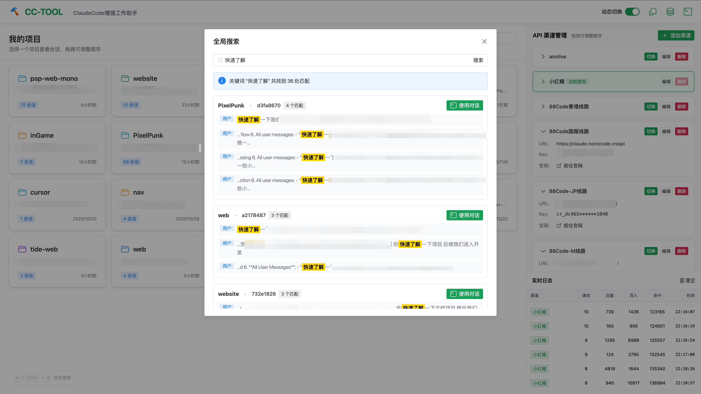

<div align="center">
  

  # CC-TOOL

  **ClaudeCode 增强工作助手 - 会话管理 & 多渠道切换工具**

  [](https://www.npmjs.com/package/cc-tool)
  [](LICENSE)

  
</div>

## 简介

CC-TOOL 是一个强大的 ClaudeCode 增强工具，提供会话管理、多渠道管理和实时监控等功能，让你的 AI 开发工作更加高效。

### 核心特性

#### 🎯 会话管理
- 📋 **项目与会话管理**：列出所有项目和会话，支持拖拽排序
- 🏷️ **会话别名**：为会话设置易记的名称
- 🔎 **全局搜索**：快捷键 `⌘/Ctrl + K` 跨项目搜索会话内容
- 🌿 **Fork 会话**：创建会话分支，保留历史版本
- 🗑️ **会话删除**：清理不需要的会话

#### 🔀 多渠道管理
- 🌐 **动态切换渠道**：无需重启，一键切换不同 API 渠道
- ⚡ **实时代理**：本地代理服务，透明切换 API 渠道
- 🎨 **渠道可视化管理**：添加、编辑、删除渠道，支持拖拽排序
- 📦 **渠道折叠**：卡片式展示，支持折叠节省空间
- 🔒 **安全管理**：API Key 脱敏显示，防止泄露

#### 📊 实时监控
- 📡 **实时日志**：WebSocket 推送，实时查看 API 请求详情
- 🎯 **Token 统计**：显示请求/回复/缓存写入/缓存命中 Token 数
- 🏷️ **行为日志**：渠道切换、会话启动等操作实时提示
- 📈 **连接状态**：WebSocket 连接状态实时显示

#### 🎨 用户体验
- 🎭 **面板控制**：自定义显示/隐藏渠道列表和日志面板
- 💾 **状态持久化**：所有设置自动保存，刷新不丢失
- 🌊 **流畅动画**：平滑的过渡动画，提升视觉体验
- 📱 **响应式设计**：适配不同屏幕尺寸

## 安装

### 从 npm 安装（推荐）

```bash
npm install -g cc-tool
```

### 从源码安装

```bash
# 克隆项目
git clone https://github.com/CooperJiang/cc-tool.git
cd cc-tool

# 安装依赖
npm install

# 全局链接
npm link
```

## 功能详解

### 📋 会话管理

#### 查看和管理会话

- **项目列表**：卡片式展示所有项目，显示会话数量
- **会话列表**：点击项目查看该项目下的所有会话
- **会话别名**：点击会话卡片的编辑按钮设置别名
- **启动会话**：点击"使用对话"直接在 ClaudeCode 中打开
- **删除会话**：清理不需要的会话

#### 全局搜索

快捷键：`⌘ + K`（Mac）或 `Ctrl + K`（Windows/Linux）

- 搜索所有项目的会话内容
- 支持搜索消息、别名、Session ID
- 高亮显示匹配的关键词
- 显示匹配次数和上下文
- 一键启动搜索到的会话

#### Fork 会话

创建会话的副本，保留原会话不变：

1. 在会话列表中点击 Fork 按钮
2. 选择 Fork 模式（继续原会话 / Fork 新分支）
3. 新会话会继承原会话的所有历史消息

> 💡 **推荐**：99% 的情况选择"继续原会话"，仅在需要保留历史版本时使用 Fork

### 🔀 多渠道管理

#### 添加 API 渠道

1. 点击右上角"添加渠道"按钮
2. 填写渠道信息：
   - **渠道名称**：如 "官方API"、"中转平台A"
   - **Base URL**：API 端点地址
   - **API Key**：你的 API 密钥
   - **官网地址**（可选）：渠道官网链接
3. 点击保存

#### 动态切换渠道

**前提条件**：开启"动态切换"功能

1. 点击顶部工具栏的"动态切换"开关
2. 在渠道列表中点击"切换"按钮
3. ClaudeCode 会自动使用新渠道，无需重启

> ⚠️ **注意**：动态切换期间请勿关闭 ClaudeCode 窗口

#### 管理渠道

- **编辑渠道**：点击"编辑"按钮修改渠道信息
- **删除渠道**：点击"删除"按钮移除渠道（使用中的渠道不能删除）
- **拖拽排序**：直接拖动卡片调整顺序，自动保存
- **折叠卡片**：点击卡片左侧箭头折叠/展开，节省空间
- **访问官网**：点击"前往官网"快速跳转到渠道官网

## 常见问题

### Q1: 动态切换不生效？

**A**: 确保：
1. 已开启"动态切换"开关
2. ClaudeCode 进程窗口未关闭
3. 配置的 API Key 和 Base URL 正确

### Q2: 实时日志面板不显示？

**A**: 实时日志需要先开启"动态切换"功能，开启后会自动显示。

### Q3: 渠道配置丢失？

**A**: 渠道配置保存在 `~/.claude/cc-tool/channels.json`，不会丢失。如果遇到问题，检查该文件是否存在和格式是否正确。

### Q4: WebSocket 连接失败？

**A**:
1. 检查端口 10099 是否被占用
2. 重启 CC-TOOL 服务
3. 查看控制台错误信息

### Q5: 如何备份配置？

**A**: 直接复制 `~/.claude/cc-tool/` 整个目录即可。

## 版本历史

### v2.0.0（最新）

**新增功能**：
- ✨ API 渠道管理系统
- ⚡ 动态切换渠道（无需重启）
- 📡 实时日志监控（WebSocket）
- 🔍 全局搜索（⌘/Ctrl + K）
- 🎨 面板可见性控制
- 📱 渠道拖拽排序和折叠
- 💾 配置持久化
- 🌊 流畅动画效果

**优化改进**：
- 🎯 全新 UI 设计
- 📊 实时 Token 统计
- 🔒 API Key 脱敏显示
- ⚙️ 性能优化（API 轮询从 5s 改为 30s）
- 🐛 修复 WebSocket 重复连接问题
- 🎨 优化加载状态和错误处理

查看 [CHANGELOG.md](docs/CHANGELOG.md) 了解详细更新记录。

## Star History

如果你喜欢这个项目，请给它一个 Star ⭐！

[](https://star-history.com/#CooperJiang/cc-tool&Date)

## 贡献

欢迎提交 Issue 和 Pull Request！

1. Fork 本仓库
2. 创建特性分支 (`git checkout -b feature/AmazingFeature`)
3. 提交更改 (`git commit -m 'Add some AmazingFeature'`)
4. 推送到分支 (`git push origin feature/AmazingFeature`)
5. 开启 Pull Request

## 许可

MIT License

---

**Made with ❤️ for ClaudeCode users**
